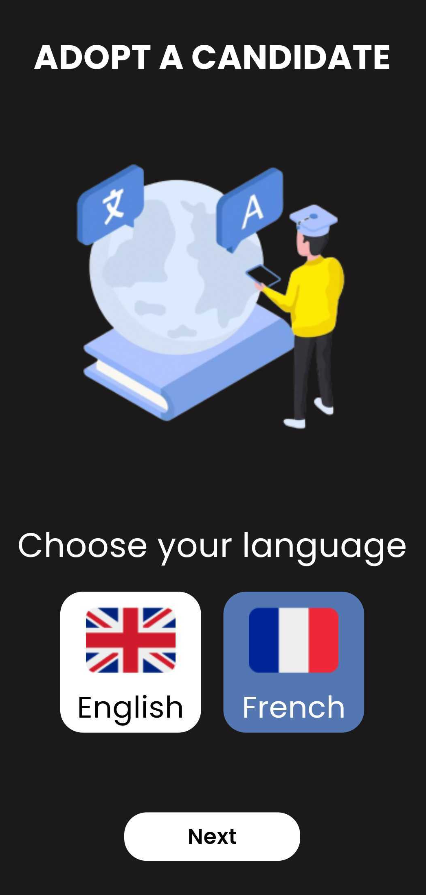
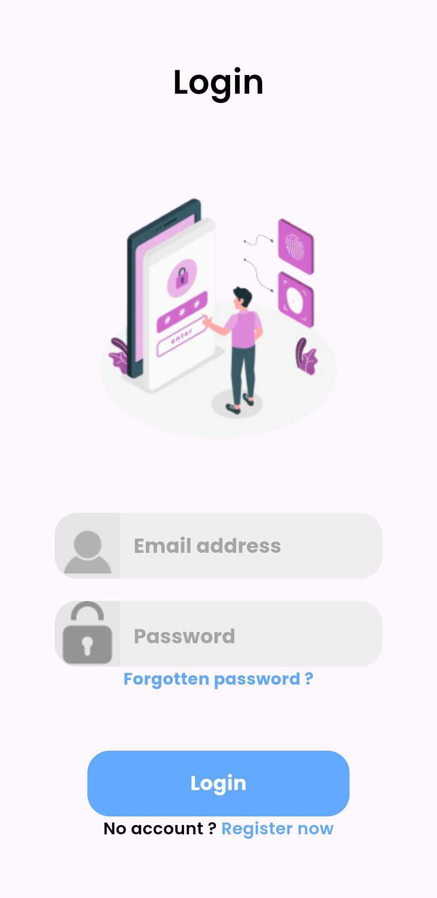
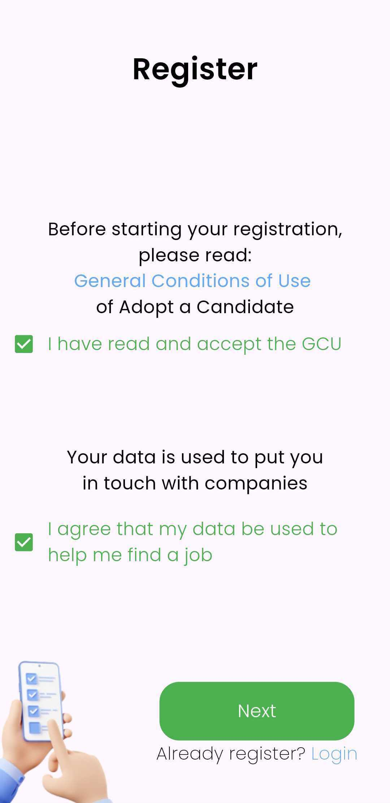
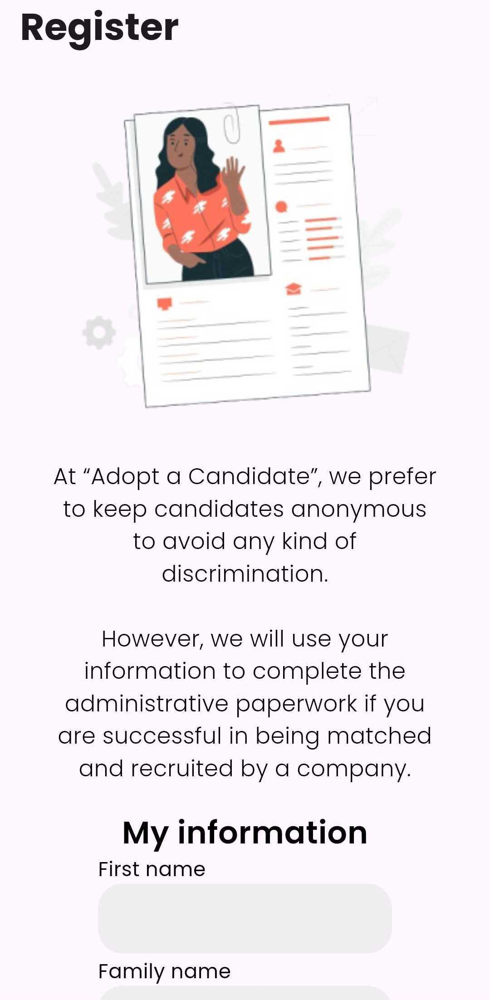
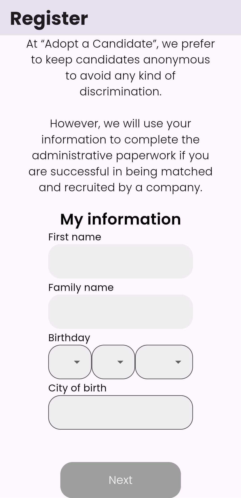
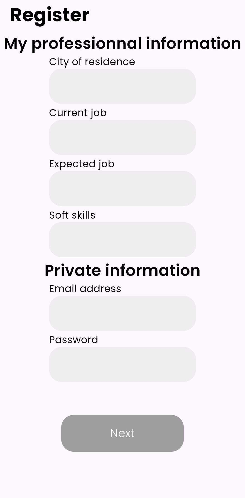
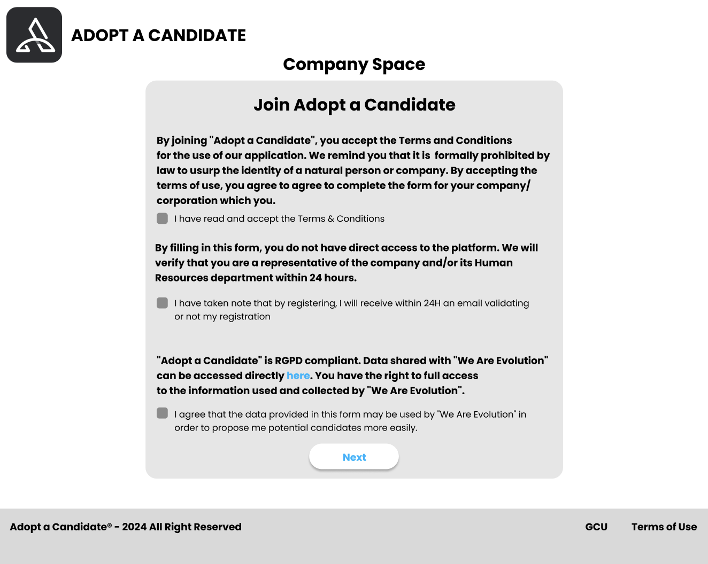
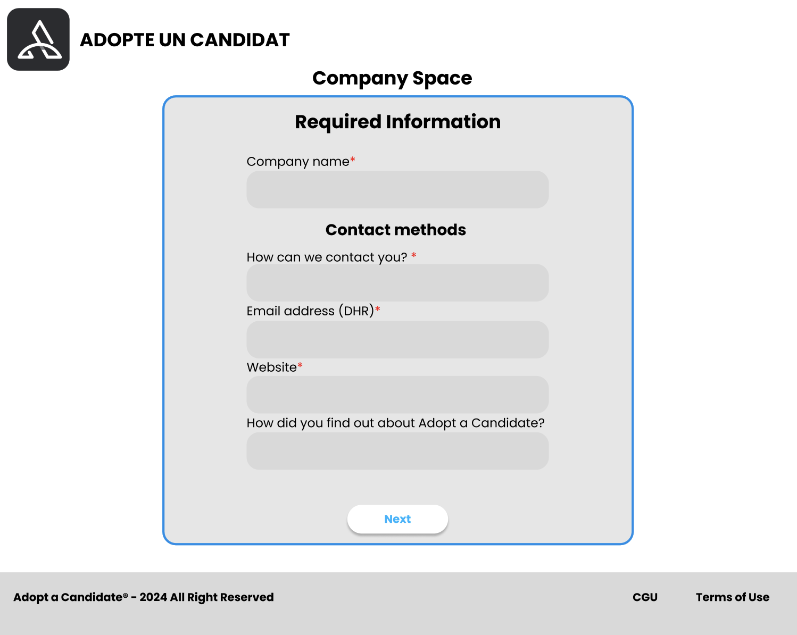

# User Manual

  <a href="#setup" style="text-decoration: none; color: inherit; flex: 1; outline: none;">
    

      

        🚧
        Setup application
      

      
Trouble installing the application? Follow the installation instructions, and check if your error has already been reported.

    

  </a>
  <a href="#acc" style="text-decoration: none; color: inherit; flex: 1; outline: none;">
    

      

        🔩
        Account creation
      

      
Need help with account creation and information? Each part of creating your account is listed below.

    

  </a>
  <a href="https://www.google.com" style="text-decoration: none; color: inherit; flex: 1; outline: none;">
    

      

        🔗
        Features
      

      
Discover all the features available on the application.

    

  </a>

## 🚧 Setup application

The “Adopt a Candidate” app is available on mobile platforms (iOS and Android) for candidates, and browser-based for companies wishing to participate in modern candidate recruitment.

I download the candidate application:

  

    
    
Available for Android 19 and above

  

  

    
    
Available for iOS 12 and above

  

 
Once the application is installed, you can launch it from your phone's home screen.

 
The application doesn't require any authorization on your device, and once installed it's ready to use on your phone. If you encounter any installation errors, please check your device version.

 
<b>If you're a company</b>, you won't need to install any applications - everything will be done on the browser at the following link:

<a href="https://www.adoptacandidate.com/company" target="_blank">https://www.adoptacandidate.com/company</a>

 
This document will be updated directly if a version is no longer supported.

## 🔩 Account creation

> You are a company ? 👉 [Create a company account](#comp)

If you are a candidate, your account will be created in 2 steps. The information collected will be anonymous to companies until you and the company decide to meet, at which point your information will be shared.

When you launch the application, you'll be asked to choose your language: English or French. <i>More languages will be implemented in the future</i>

> 1. Select your language

 

> 2. Press “Register Now"

 

> 3. Read and accept the terms of use

 

> 4. Enter your first personal information
> > First name
> 
> > Last name
> 
> > Date of birthday
> 
> > City of birth - (Enter the first letters and the application will find the city)

    
    

 

> 5. Enter your personal information
>
>  > City of residence - (Enter the first letters and the application will find the city)
>
>  > Your current job
>
>  > Your expexted job
>
>  > Your soft skills
>
>  > Your email - (This email will be used to create your account)
>
>  > Your password

    

Congratulations, you've successfully created your account! 🎉

> ⚠️ Having trouble creating your account? An unexpected error? Try again a few minutes later, or contact customer support.

## 🔩 Account creation for companies

> You are a candidate ? 👉 [Create a candidate account](#acc)

Are you a company looking to join the "Adopt a Candidate" experience to recruit your new profiles? You've come to the right place.

To create your company account, you'll need to provide some information about your company. This information will be used to create your company profile, which will be visible to candidates.

> 1. Go to the website, and it will be translated directly for your region.

> 2. Once on the registration page, you will be taken to the form to confirm that you accept the terms of use, that your account will not be active for the first 24 hours for verification purposes and that the data we use is RGPD friendly.
> 

 

> 3. Enter your company information
>
> > Company name
>
> > Contact method
>
> > Mail address of the DHR
>
> > Website URL
>
> > How do you find us ?

 

Once you have filled in this information, we will contact you within the next 24 hours to find out more about the company (which also allows us to verify that you are the company).

> ⚠️ If you have not received a reply from us within 24 hours, please allow us a further 24 hours. If you haven't heard from us in 48 hours, please contact our company service department.

## 🔩 Features

